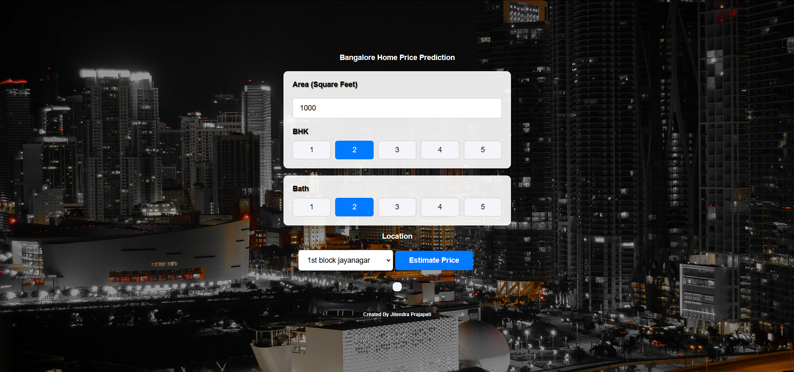
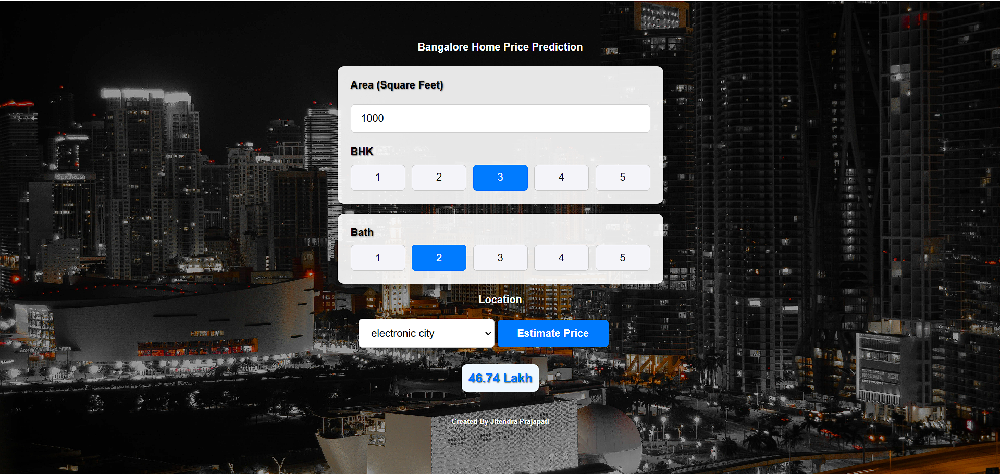
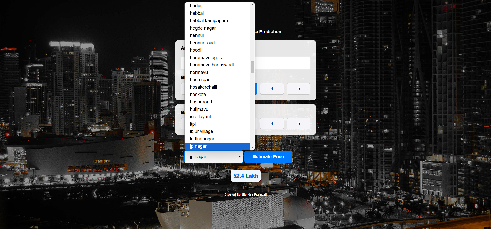

Here’s a sample **README.md** file for your "Bangalore House Price Prediction" project:

---

# Bangalore House Price Prediction  



## 🏠 About the Project  
This project is a web-based application that predicts the price of houses in Bangalore based on user inputs such as area, BHK, bathrooms, and location. It uses a **Linear Regression model** with an accuracy score of **84%**. The front-end is built with **HTML, CSS, and JavaScript**, while the back-end utilizes **Python** and **Flask**.

---

## 📸 Screenshots  
### 1. Home Page  
  

### 2. Prediction Result  
  

---

## 🛠️ Features  
- **Input Fields**: Area, BHK, Bathrooms, and Location.  
- **Price Prediction**: Real-time prediction using the trained Linear Regression model.  
- **Responsive Design**: Works seamlessly across devices.  
- **Clean UI**: Minimalistic design for user-friendly interaction.  

---

## 🔧 Tech Stack  
- **Front-end**:  
  - HTML  
  - CSS  
  - JavaScript  

- **Back-end**:  
  - Flask  
  - Python  

- **Machine Learning Model**:  
  - Linear Regression with 84% accuracy.  

---

## 🖥️ How to Run the Project  

### Prerequisites  
Ensure the following are installed:  
1. Python 3.12.4  
2. Flask  
3. NumPy, Pandas, Scikit-learn  

### Installation Steps  
1. Clone the repository:  
   ```bash  
   git clone https://github.com/yourusername/bangalore-house-price-prediction.git  
   ```  
2. Navigate to the project directory:  
   ```bash  
   cd bangalore-house-price-prediction  
   ```  
3. Install dependencies:  
   ```bash  
   pip install -r requirements.txt  
   ```  
4. Run the Flask app:  
   ```bash  
   python app.py  
   ```  
5. Open the app in your browser at `http://127.0.0.1:5000/`.  

---

## 📊 Model Training  
- **Algorithm Used**: Linear Regression.  
- **Dataset**: Kaggle Dataset (House Prices in Bangalore).  
- **Preprocessing**:  
  - Categorical encoding for locations.  
  - Normalization of numerical features.  
- **Performance Metrics**:  
  - Model Accuracy: 84%.  
  - Mean Squared Error: Low, indicating accurate predictions.  

---

## 🖼️ Project Flow  
1. **User Input**: Users provide house details via the form.  
2. **Back-end Processing**:  
   - Flask fetches the inputs.  
   - The trained Linear Regression model predicts the house price.  
3. **Result Display**: The predicted price is displayed on the screen.  

---

## 🚀 Future Enhancements  
- Use advanced machine learning models for higher accuracy.  
- Add more input features (e.g., amenities, age of the house).  
- Deploy the project online using platforms like Heroku or AWS.  
- Provide data visualizations for price trends in different locations.  

---

## 🤝 Contributors  
- **Your Name** - Developer and Machine Learning Engineer.  

---

## 📜 License  
This project is licensed under the MIT License.  

---

## 📝 Acknowledgments  
- Dataset sourced from Kaggle.  
- Inspiration for UI from Material Design.  

---

## if using nginx 
- make Changes in file path:  nginx-1.27.3 > conf > nginx.conf
#access_log  logs/host.access.log  main;

        location / {
            root   "replace the address with "app.html" address";
            index  index.html index.htm app.html;
        }
- use nginx code in .js file
"# Bangalore-House-Price-Prediction" 
